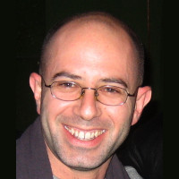
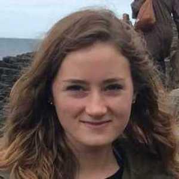
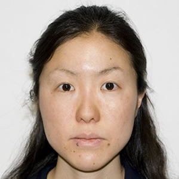
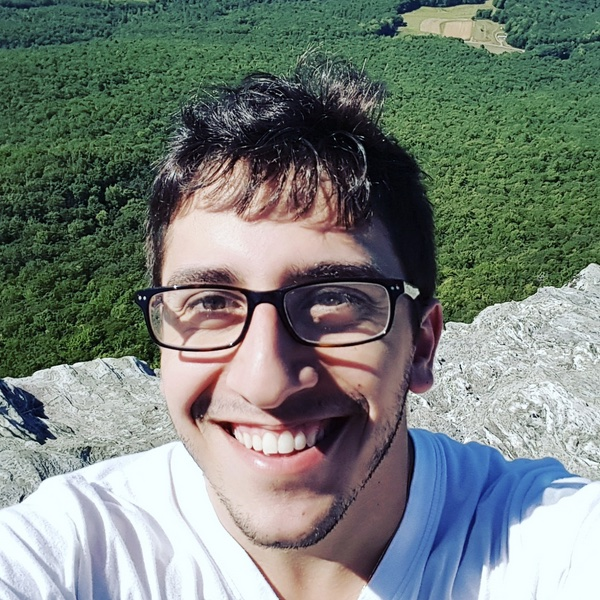
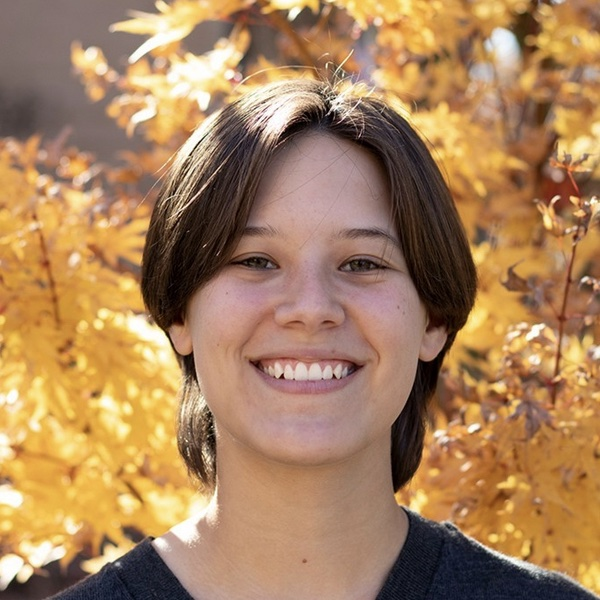
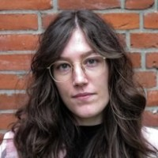
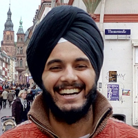

**Michael I. Love** (he/him/his)   
Associate Professor - 
[Genetics](http://www.med.unc.edu/genetics/) and
[Biostatistics](http://sph.unc.edu/bios/biostatistics/)
at UNC-Chapel Hill  
Associate Director - [Bioinformatics and Computational Biology (BCB) PhD program](https://bcb.unc.edu/)

[Google Scholar](https://scholar.google.com/citations?user=vzXv764AAAAJ) ~
[Curriculum Vitae](../assets/michael_love_cv.pdf) 
<a rel="me" href="https://genomic.social/@mikelove">@mikelove@genomic.social</a> ~
@mikelove.bsky.social

Email: michaelisaiahlove [at] gmail / love [at] unc.edu

For software support, please post to [Bioconductor support site](https://support.bioconductor.org).

---

| Name | Research topics | Position | ~~~~~~~~~~ |
| :--- | :---- | :---- |
| Michael Love | Statistical software for genomic data analysis;   Causal mechanisms for GWAS loci | PI |  |
| Jon Rosen | Functional interrogation of GWAS variants;   MPRA library design and analysis in IGVF and AMP-CMD;   [Gen. Epi. of HLB Traits](https://hlbgenepit32.web.unc.edu/), [Karen Mohlke lab](https://mohlke.web.unc.edu/)  | Post-doctoral |  |
| [Euphy Wu](https://www.linkedin.com/in/euphy-wu-09b14383)   [@FennecPaaaw](https://twitter.com/FennecPaaaw) | Isoform-level allelic imbalance: [SEESAW](https://mikelove.github.io/fishpond/articles/allelic.html);   Co-supervised with Naim Rashid | PhD candidate (Bios) |  |
| [Ji-Eun Park](https://jennprk.github.io/)   [@JiEunPark](https://twitter.com/_JiEun_Park_) | Mutational signatures and risk factors in cancer;   Co-supervised with Di Wu | PhD candidate (Bios) |  |
| [Rachel Sharp](https://www.linkedin.com/in/rachel-sharp-a07b69272)   [@rrsharp122](https://twitter.com/rrsharp122) | Neuropsychiatric GWAS variants, GxE | PhD candidate (Neuro/BCB) |  |
| Yuriko Harigaya | Statistical methods for response QTL   Co-supervised with William Valdar | PhD candidate (BCB) |  |
| [Justin Landis](https://www.linkedin.com/in/justin-landis-64a586139) | Long-read RNA-seq methods | PhD candidate (BCB) |  |

## Alumni

### Doctoral students

| Name | Research topic | Current position | ~~~~~~~~~~ |
| :--- | :---- | :---- | :---- |
| [Wancen Mu](https://wancen.github.io/)   [@wancenm](https://twitter.com/wancenm?lang=en) | Allelic imbalance in scRNA-seq: [airpart](https://bioconductor.org/packages/airpart);   Bootstrap enrichment analysis: [nullranges](https://bioconductor.org/packages/nullranges);   Gaussian processes for multi-omic time series;   Predictive modeling of gRNA efficiency | Celonis |  |
| [Sarah Reifeis](https://www.linkedin.com/in/sarah-reifeis-phd-5943b1157/) [@sarah_reifeis](https://twitter.com/sarah_reifeis) | Exposure effects with confounding | Eli Lilly |  |
| [Scott Van Buren](https://www.linkedin.com/in/scottvanburen/) | scRNA-seq quantification uncertainty | GSK |  |
| [Achal Patel](https://www.linkedin.com/in/achal-patel-166733202?original_referer=https%3A%2F%2Fwww.google.com%2F)   [@pateap07](https://twitter.com/pateap07) | Breast cancer TWAS | Genentech |  |
| [Arjun Bhattacharya](https://bhattacharya-a-bt.github.io) [@bhattac_a_bt](https://twitter.com/bhattac_a_bt) | TWAS for breast cancer outcomes; Multi-omic strategies in TWAS: [MOSTWAS](https://bhattacharya-a-bt.github.io/MOSTWAS/); Compressed sensing for deconvolution: [DeCompress](https://bhattacharya-a-bt.github.io/DeCompress/) | [Assist. Prof., MD Anderson](https://bhattacharya-lab.com/) |  | 
| [Sean McCabe](https://mccabes292.github.io/) [@SeanMcCabeBIOS](https://twitter.com/SeanMcCabeBIOS) | Multi-omics visualization: [movie](https://github.com/mccabes292/movie); LDA of isoforms: [actor](https://github.com/mccabes292/actor) | [Assist. Prof., Indiana Univ.](https://medicine.iu.edu/faculty/62984/mccabe-sean) |  |
| [Anqi Zhu](https://azhu513.github.io)   [@anqiz91](https://twitter.com/anqiz91) | Differential analysis in RNA-seq; Developed [apeglm](http://bioconductor.org/packages/apeglm), [swish](http://bioconductor.org/packages/fishpond), [mrlocus](https://mikelove.github.io/mrlocus) | Genentech |  |

### Masters and bachelors students

| Name | Research topic | Current position | ~~~~~~~~~~ |
| :--- | :---- | :---- | :---- |
| [Isabella Gamez](https://www.linkedin.com/in/isabella-gamez-3766a01b5) | Bacterial RNA-seq - Rita Tamayo lab | NIEHS post-bac |  |
| [Kwame Forbes](https://kwameforbes.github.io/) [@kwame_forbes](https://twitter.com/kwame_forbes) | Integration of single cell expression data for exploration of bulk DE analysis | UNC BCB |  |
| Alexandre Lockhart | Identification of mutational signatures via targeted sequencing | Rho Inc. |  |

## Collaborators

| Name | Research topic | ~~~~~~~~~~ |
| :--- | :---- | :---- | :---- |
| Amanda Tapia | Colocalization of QTL and GWAS |  |
| Joshua Zitovsky | Fast implementation of *apeglm* for allelic expression ratios |  | 

## Friends of the lab

(Current or former students from other labs that have contributed to Love Lab research)

| Name | Research topic | School (lab) | ~~~~~~~~~~ |
| :--- | :---- | :---- | :---- |
| [Anna A. Monaco](https://de.linkedin.com/in/anna-alessandra-monaco-a01623141)   [@AnnaAMonaco](https://twitter.com/AnnaAMonaco) | Molecular Biology/Genetics/Evo-Devo | Robert Zinzen (Berlin) |  |
| [Noor P. Singh](https://noorpratap.netlify.app/)   [@pratapnoor](https://twitter.com/pratapnoor) | Statistical methods for RNA-seq | UMD (Patro) |  |
| [Dongze He](https://combine-lab.github.io/members/dongze-he.html)   [@dongzehe](https://twitter.com/dongzehe) | Single-cell RNA-seq | UMD (Patro) |  |
| [Avi Srivastava](https://k3yavi.github.io/)   [@k3yavi](https://twitter.com/k3yavi) | Fast mapping, scRNA-seq quant. | SBU (Patro) |  |
| [Hirak Sarkar](https://hiraksarkar.github.io/)   [@hiraksarkar](https://twitter.com/hiraksarkar) | Selective alignment,   scRNA-seq simulation,   transcript grouping | UMD (Patro) |  |
| [Stuart Lee](https://stuartlee.org/)   [@_stuartlee](https://twitter.com/_stuartlee) | Human-centred data science,   tidy range operations | Melbourne |  |
