

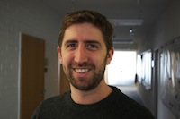

 PI: Michael I. Love 

 (he/him/his) 

Assistant Professor, 
[Department of Biostatistics](http://sph.unc.edu/bios/biostatistics/) &
[Department of Genetics](http://www.med.unc.edu/genetics/), 
Member of [Lineberger Comprehensive Cancer Center](https://unclineberger.org/)  
University of North Carolina-Chapel Hill

[@mikelove](http://twitter.com/mikelove) ---
[Google Scholar](https://scholar.google.com/citations?user=vzXv764AAAAJ) ---
[UNC Biostat](http://sph.unc.edu/adv_profile/michael-love-phd/) --- [CV](../assets/michael_love_cv.pdf)

Email: michaelisaiahlove at gmail --- for software questions,
do not email, instead post to the [support site](https://support.bioconductor.org).

| Name | Research topics | ~~~~~~~~~~ |
| :--- | :---- | :---- |
| Jon Rosen | Functional interrogation of GWAS variants | |
| [Euphy Wu](https://www.linkedin.com/in/euphy-wu-09b14383) | Detecting allelic imbalance at isoform-level in bulk RNA-seq   co-advised by Naim Rashid |  |
| [Wancen Mu](https://scholar.google.com/citations?user=mw7wEcsAAAAJ&hl=en)   [@wancenm](https://twitter.com/wancenm?lang=en) | Allelic imbalance across groups of cells in scRNA-seq: [airpart](https://bioconductor.org/packages/airpart);   Bootstrap enrichment analysis: [nullranges](https://bioconductor.org/packages/nullranges) | 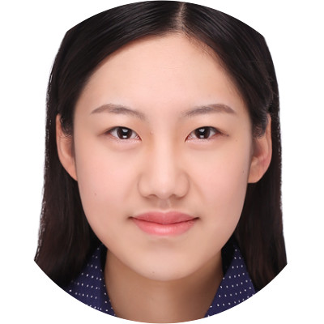 |
| [Ji-Eun Park](https://www.linkedin.com/in/ji-eun-park) | Mutational signatures and risk factors in breast cancer;   Co-supervised with Di Wu | 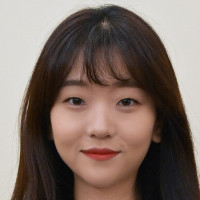 |

## Alumni

### Love lab graduates

Doctoral students

| Name | Research topic | Current position | ~~~~~~~~~~ |
| :--- | :---- | :---- | :---- |
| [Sarah Reifeis](https://scholar.google.com/citations?user=f4mwC_0AAAAJ&hl=en) [@sarah_reifeis](https://twitter.com/sarah_reifeis) | Exposure effects with confounding | Eli Lilly |  |
| [Scott Van Buren](https://scholar.google.com/citations?user=tq0VCBcAAAAJ&hl=en) | scRNA-seq quantification uncertainty | Harvard FAS Informatics | 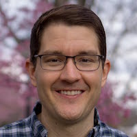 |
| [Arjun Bhattacharya](https://bhattacharya-a-bt.github.io) [@bhattac_a_bt](https://twitter.com/bhattac_a_bt) | TWAS for breast cancer outcomes; Multi-omic strategies in TWAS: [MOSTWAS](https://bhattacharya-a-bt.github.io/MOSTWAS/); Compressed sensing for deconvolution: [DeCompress](https://bhattacharya-a-bt.github.io/DeCompress/) | Postdoc in Pasaniuc lab | 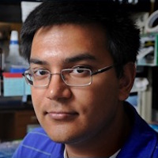 | 
| [Sean McCabe](https://mccabes292.github.io/) [@SeanMcCabeBIOS](https://twitter.com/SeanMcCabeBIOS) | Multi-omics visualization: [movie](https://github.com/mccabes292/movie); LDA of isoforms: [actor](https://github.com/mccabes292/actor) | Postdoc in Lin lab | 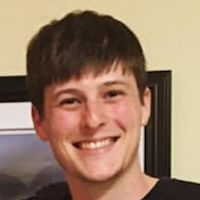 |
| [Anqi Zhu](https://azhu513.github.io)   [@anqiz91](https://twitter.com/anqiz91) | Differential analysis in RNA-seq; Developed [apeglm](http://bioconductor.org/packages/apeglm), [swish](http://bioconductor.org/packages/fishpond), [mrlocus](https://mikelove.github.io/mrlocus) | Genentech |  |

Masters and bachelors students

| Name | Research topic | Current position | ~~~~~~~~~~ |
| :--- | :---- | :---- | :---- |
| [Kwame Forbes](https://kwameforbes.github.io/) [@kwame_forbes](https://twitter.com/kwame_forbes) | Integration of single cell expression data for exploration of bulk DE analysis | UNC BBSP | 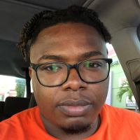 |
| Alexandre Lockhart | Identification of mutational signatures via targeted sequencing | Rho Inc. | 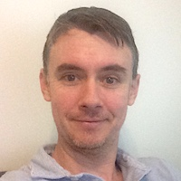 |

## Collaborators

| Name | Research topic | Current position &nbsp; &nbsp; &nbsp; | |
| :--- | :---- | :---- | :---- |
| Amanda Tapia | Colocalization of QTL and GWAS | Li lab member |  |
| Joshua Zitovsky | Fast implementation of *apeglm* for allelic expression ratios | Kosorok lab member | 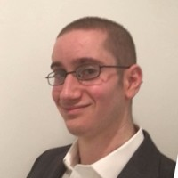 | 

## Friends of the lab

| Name | Research topic | School (lab) | |
| :--- | :---- | :---- | :---- |
| [Avi Srivastava](https://k3yavi.github.io/)   [@k3yavi](https://twitter.com/k3yavi) | Fast mapping, scRNA-seq quantification | Stony Brook University (Patro) | 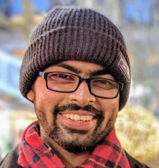 |
| [Hirak Sarkar](https://hiraksarkar.github.io/)   [@hiraksarkar](https://twitter.com/hiraksarkar) | Selective alignment,   scRNA-seq simulation,   transcript grouping | University of Maryland (Patro) |  |
| [Stuart Lee](https://stuartlee.org/)   [@_stuartlee](https://twitter.com/_stuartlee) | Human centred approaches to data science,   tidy range operations | Monash University | 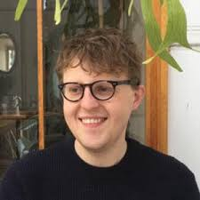 |
