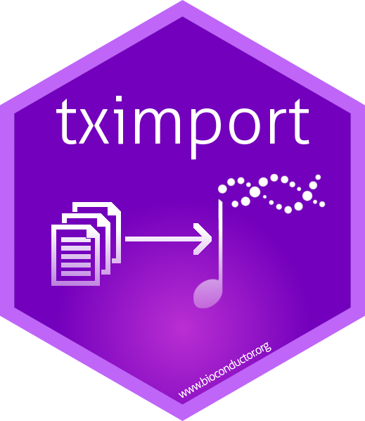
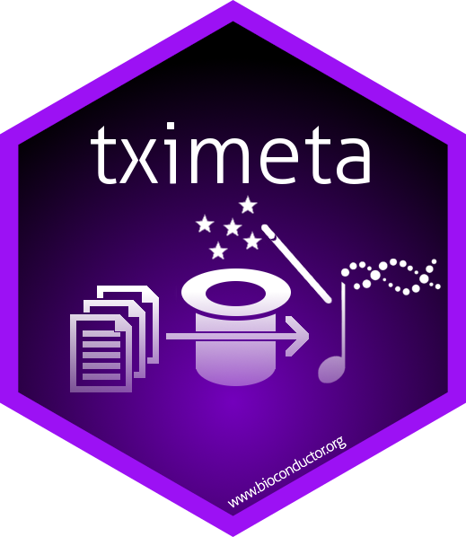
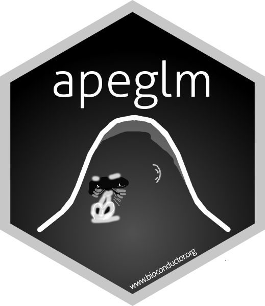

### Maintained by the Love Lab

**highly used**

<a class="btn btn-primary"
href="https://bioconductor.org/packages/DESeq2"
role="button">DESeq2</a>
<a class="btn btn-secondary"
href="https://bioconductor.org/packages/stats/bioc/DESeq2/"
role="button">usage stats</a>

* Estimate variance-mean dependence in count data from high-throughput
sequencing assays and test for differential expression based on a
model using the negative binomial distribution.
Collaboration with Simon Anders and Wolfgang Huber (EMBL Heidelberg).

<a class="btn btn-primary"
href="https://bioconductor.org/packages/tximport"
role="button">tximport</a>
<a class="btn btn-secondary"
href="https://bioconductor.org/packages/stats/bioc/tximport/"
role="button">usage stats</a>

* Imports transcript-level abundance, estimated counts and transcript
lengths, and summarizes into matrices for use with downstream
gene-level analysis packages such as edgeR, DESeq2, limma-voom.
Collaboration with Charlotte Soneson and Mark Robinson (UZH Zürich)

<a class="btn btn-primary"
href="https://bioconductor.org/packages/apeglm"
role="button">apeglm</a>
<a class="btn btn-secondary"
href="https://bioconductor.org/packages/stats/bioc/apeglm/"
role="button">usage stats</a>

* Bayesian shrinkage estimators for effect sizes for a variety of GLM
models, using approximation of the posterior for individual
coefficients.  Developed by Anqi Zhu (UNC-CH), collaboration with
Joseph Ibrahim (UNC-CH). `apeglm` methods can be accessed via `lfcShrink`
in the [DESeq2](http://bioconductor.org/packages/DESeq2) package.

---

**newly developed**

<a class="btn btn-primary"
href="https://github.com/mikelove/fishpond"
role="button">fishpond</a>

* `swish` is a nonparametric differential transcript and gene analysis
  method making use of inferential replicate counts. Collaboration
  with Anqi Zhu and Joseph Ibrahim (UNC-CH), and Avi Srivastava and
  Rob Patro (SBU).

<a class="btn btn-primary"
href="https://bioconductor.org/packages/tximeta"
role="button">tximeta</a>

* Import transcript abundances with automatic population of metadata.
  Builds on top of `tximport`, outputs a `SummarizedExperiment` object
  with transcriptome metadata automatically added. Collaboration with
  Rob Patro (SBU), Charlotte Soneson (UZH), and Peter Hickey (WEHI).

<a class="btn btn-primary"
href="https://github.com/mccabes292/movie"
role="button">movie</a>

* A framework for evaluating variance classification methods using
  multi-omics data. Using data segmentation, this framework aims to
  identify the consistency and the extent of overfitting of
  multi-omics methods. Developed by Sean McCabe (UNC-CH),
  collaboration with Dan-Yu Lin (UNC-CH).

---

<a class="btn btn-primary"
href="https://bioconductor/packages/alpine"
role="button">alpine</a>

* Modeling and correcting fragment sequence bias for RNA-seq transcript
abundance estimation. 
Collaboration with Rafael Irizarry (DFCI Boston).

<a class="btn btn-primary"
href="https://bioconductor.org/packages/exomeCopy"
role="button">exomeCopy</a>

* Detection of copy number variants (CNV) from exome sequencing samples,
including unpaired samples. The package implements a hidden Markov
model which uses positional covariates, such as background read depth
and GC-content, to simultaneously normalize and segment the samples
into regions of constant copy count.
Collaboration with Alena van Bömmel, Stefan Haas and Martin Vingron
(MPI Berlin).

<a class="btn btn-primary"
href="http://github.com/mikelove/SparseData"
role="button">SparseData</a>

* Efficiently calculate statistics such as group mean, standard
deviation and t-statistics on large sparse genomic data sets.

### Published workflows

<a class="btn btn-primary"
href="https://bioconductor.org/packages/rnaseqGene"
role="button">rnaseqGene</a>

* RNA-seq workflow: gene-level exploratory analysis and differential
  expression. [F1000R](https://doi.org/10.12688/f1000research.7035.2)

<a class="btn btn-primary"
href="https://bioconductor.org/packages/rnaseqDTU"
role="button">rnaseqDTU</a>

* Swimming downstream: statistical analysis of differential transcript
  usage following Salmon quantification.
  [F1000R](https://doi.org/10.12688/f1000research.15398.3)

### Contributor

<a class="btn btn-primary"
href="https://combine-lab.github.io/salmon/"
role="button">Salmon</a>

* Software for quantifying
the expression of transcripts using RNA-seq data, developed and
maintained by Rob Patro (SBU). The Love lab collaborates with
Dr. Patro on bias correction methods, on estimation of uncertainty
through Gibbs and bootstrap sampling, and on propagation 
of metadata from abundance estimation to downstream analysis packages.

<a class="btn btn-primary"
href="http://bioconductor.org/packages/GenomicFiles"
role="button">GenomicFiles</a>

* Provides infrastructure for parallel computations
distributed 'by file' or 'by range'. User defined MAPPER and REDUCER
functions provide added flexibility for data combination and manipulation.
Collaboration with Valerie Obenchain and Martin Morgan (Bioconductor
core team).

<a class="btn btn-primary"
href="https://cran.r-project.org/package=rafalib"
role="button">rafalib</a>

* A series of shortcuts for routine tasks.
Collaboration with Rafael Irizarry (DFCI Boston).

### Data packages

[macrophage](http://bioconductor.org/packages/macrophage)
This package provides the output of running Salmon on a set of 24
RNA-seq samples from 
[Alasoo, et al.](https://doi.org/10.1038/s41588-018-0046-7), 
"Shared genetic effects on chromatin and gene expression indicate a
role for enhancer priming in immune response", published in Nature
Genetics, January 2018.

[oct4](http://bioconductor.org/packages/oct4)
This package provides the output of running Salmon on a set of 12
RNA-seq samples from 
[King & Klose](https://doi.org/10.7554/eLife.22631),
"The pioneer factor OCT4 requires the chromatin remodeller BRG1 to
support gene regulatory element function in mouse embryonic stem
cells", published in eLIFE, March 2017.

[airway](http://bioconductor.org/packages/airway)
This package provides a SummarizedExperiment object of read counts in
genes for an RNA-Seq experiment on four human airway smooth muscle
cell lines treated with dexamethasone.
The citation for the experiment is:
[Himes BE et al (2014)](http://www.ncbi.nlm.nih.gov/pmc/articles/PMC4057123/).

[fission](http://bioconductor.org/packages/fission)
This package provides a SummarizedExperiment object of read counts in
genes for a time course RNA-Seq experiment of fission yeast
(Schizosaccharomyces pombe) in response to oxidative stress (1M
sorbitol treatment) at 0, 15, 30, 60, 120 and 180 mins.
The citation for the experiment is:
[Leong HS et al. (2014)](http://www.ncbi.nlm.nih.gov/pmc/articles/PMC4050258/).

[parathyroidSE](http://bioconductor.org/packages/parathyroidSE)
This package provides SummarizedExperiment objects of read counts in
genes and exonic parts for paired-end RNA-Seq data from experiments on
primary cultures of parathyroid tumors.
The citation for the experiment is:
[Haglund F et al (2012)](http://www.ncbi.nlm.nih.gov/pubmed/23024189).

[tximportData](https://bioconductor.org/packages/tximportData)
This packages provides output files from common transcript estimation
software (Salmon, Kallisto, RSEM, Cufflinks) for demonstration of
import using `tximport`. The files are a subset of 6 samples from the
GEUVADIS project. The citation for the GEUVADIS project is:
[Lappalainen et al (2013)](http://www.nature.com/nature/journal/v501/n7468/full/nature12531.html?WT.ec_id=NATURE-20130926)

[alpineData](https://bioconductor.org/packages/alpineData)
This packages provides a subset of alignments for demonstration of
`alpine`. The samples aligned are a subset of 4 samples from the
GEUVADIS project. The citation for the GEUVADIS project is:
[Lappalainen et al (2013)](http://www.nature.com/nature/journal/v501/n7468/full/nature12531.html?WT.ec_id=NATURE-20130926)
