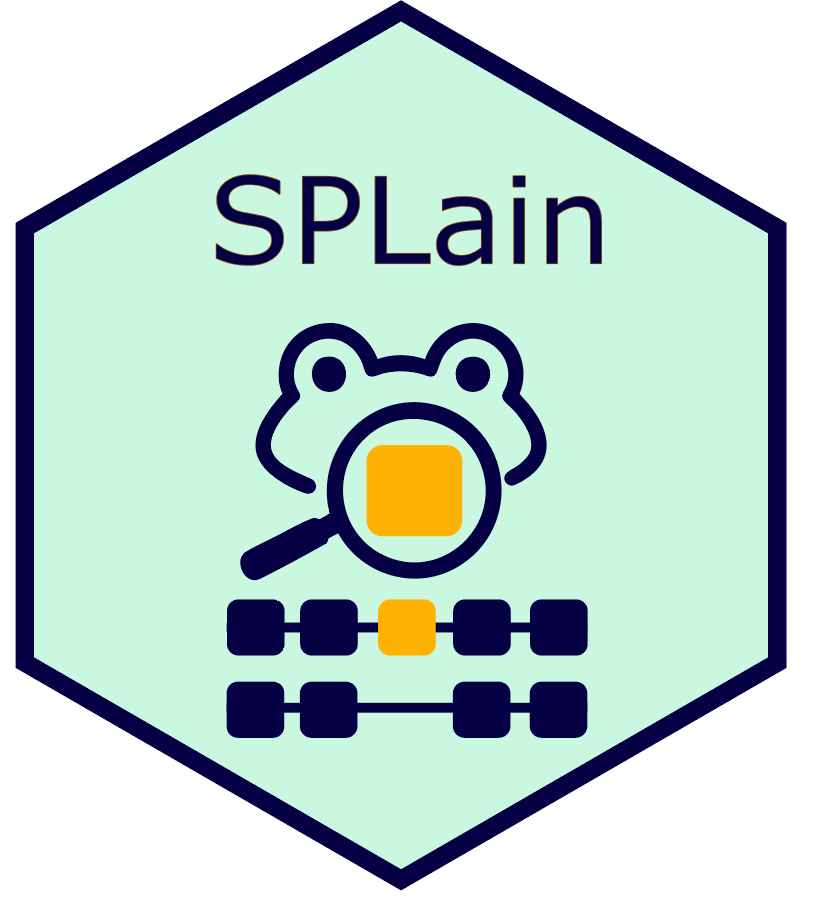

 

**GitHub page**

Most software from the Love Lab is part of the [Bioconductor
Project](https://bioconductor.org). However we also provide mirrors of
the software on GitHub:

* <https://github.com/thelovelab>

We are also involved in a large collaborative project in Bioconductor
called `tidyomics`:

* <https://github.com/tidyomics>

**Highly used**

<a class="btn btn-primary"
href="https://bioconductor.org/packages/DESeq2"
role="button">DESeq2</a>
<a class="btn btn-secondary"
href="https://bioconductor.org/packages/stats/bioc/DESeq2/"
role="button">usage stats</a>

* Test for differential expression based on Negative Binomial GLM. 
Collaboration with Simon Anders and Wolfgang Huber (EMBL Heidelberg).

<a class="btn btn-primary"
href="https://bioconductor.org/packages/tximport"
role="button">tximport</a>
<a class="btn btn-secondary"
href="https://bioconductor.org/packages/stats/bioc/tximport/"
role="button">usage stats</a>

* Imports transcript-level abundance, estimated counts and transcript
lengths. 
Collaboration with Charlotte Soneson (FMI) and Mark Robinson (UZH Zürich).

<a class="btn btn-primary"
href="https://thelovelab.github.io/tximeta"
role="button">tximeta</a>
<a class="btn btn-secondary"
href="https://bioconductor.org/packages/stats/bioc/tximeta/"
role="button">usage stats</a>

* Import transcript abundances with automatic population of metadata. 
Collaboration with Rob Patro (UMD), Charlotte Soneson (FMI), and Peter Hickey (WEHI).

<a class="btn btn-primary"
href="https://bioconductor.org/packages/apeglm"
role="button">apeglm</a>
<a class="btn btn-secondary"
href="https://bioconductor.org/packages/stats/bioc/apeglm/"
role="button">usage stats</a>

* Bayesian shrinkage estimators for effect sizes for a variety of GLM
models. 
Developed by Anqi Zhu (UNC-CH), collaboration with Joseph Ibrahim
(UNC-CH).  
`apeglm` methods can be accessed via `lfcShrink`
in the [DESeq2](http://bioconductor.org/packages/DESeq2) package.

<a class="btn btn-primary"
href="https://thelovelab.github.io/fishpond"
role="button">fishpond</a>
<a class="btn btn-secondary"
href="https://bioconductor.org/packages/stats/bioc/fishpond/"
role="button">usage stats</a>

* `swish` is a nonparametric differential transcript and gene analysis
  method making use of inferential replicate counts. Collaboration
  with Anqi Zhu and Joseph Ibrahim (UNC-CH), and Avi Srivastava and
  Rob Patro (UMD). 
*  `SEESAW` is a suite of methods for allelic expression analysis led
  by Euphy Wu (UNC-CH)  in collaboration with Gary Churchill (JAX), KB
  Choi, Cheryl Ackert-Bicknell (UColorado), Rob Patro (UMD) and others.

---

**Newly developed**

<a class="btn btn-primary"
href="https://jtlandis.github.io/plyxp/"
role="button">plyxp</a>

* Bioconductor package that provides efficient abstractions to the
  SummarizedExperiment such that using common dplyr functions feels as natural
  to operating on a data.frame or tibble. Part of the tidyomics project.
  Funding provided by Wellcome Trust -- EOSS award.

<a class="btn btn-primary"
href="https://yharigaya.github.io/classifygxt"
role="button">classifygxt</a>

* R package for classifying gene-by-treatment (GxT) interactions using Bayesian
  model selection (BMS). The method is primarily designed for molecular count
  phenotypes, such as gene expression and chromatin accessibility.
  Developed by Yuriko Harigaya, co-supervised by Will Valdar.

<a class="btn btn-primary"
href="https://IGVF.github.io/rigvf"
role="button">rigvf</a>

* Bioconductor package that provides an interface to the IGVF Catalog data.

<a class="btn btn-primary"
href="https://github.com/jennprk/diffsig"
role="button">diffsig</a>

* R package for estimating the association of risk factors with
  mutational signatures, making use of a Bayesian
  Dirichlet-multinomial hierarchical model for counts.
  Developed by Ji-Eun Park, in collaboration with labs of Melissa
  Troester and Katie Hoadley.

<a class="btn btn-primary"
href="https://nullranges.github.io/nullranges"
role="button">nullranges</a>

* Modular package for generation of sets of ranges representing the
  null hypothesis. These can take the form of `bootRanges`, block
  bootstrap samples of ranges, or `matchRanges`, sets of control
  ranges that are matched across one or more covariates. 
  Developed by Wancen Mu, Eric Davis, and Douglas Phanstiel (UNC-CH). 
  Contributions from other Bioconductor developers as well.
  Funding provided by CZI -- EOSS award.

---

**Research packages**

<a class="btn btn-primary"
href="https://thelovelab.github.io/mrlocus"
role="button">MRLocus</a>

* Bayesian estimation of the gene-to-trait effect from eQTL and GWAS
  summary data for loci displaying allelic heterogeneity, that is,
  containing multiple LD-independent eQTLs.
  Developed in collaboration with Anqi Zhu, Nana Matoba, and Jason
  Stein (UNC-CH).

<a class="btn btn-primary"
href="https://bioconductor.org/packages/airpart"
role="button">airpart</a>

* Identification of differential cell-type-specific allelic imbalance
  across cell types or states, utilizing single-cell allelic counts.
  Provides partitioning of cell types by allelic signal using
  generalized fused lasso, plus many EDA and QC plotting functions.
  Developed by Wancen Mu, in collaboration with the Patro group
  (UMD) and KB Choi (JAX).

<a class="btn btn-primary"
href="https://bhattacharya-a-bt.github.io/DeCompress"
role="button">DeCompress</a>

* A semi-reference free method that uses compressed sensing to
  deconvolve tissue compartments from bulk mRNA expression from
  targeted panels, like NanoString nCounter.
  Developed by Arjun Bhattacharya (UNC-CH).

<a class="btn btn-primary"
href="https://bhattacharya-a-bt.github.io/MOSTWAS"
role="button">MOSTWAS</a>

* Suite of tools to prioritize distal variants in transcriptomic
  prediction, and conduct TWAS-like association testing using GWAS
  summary statistics.
  Developed by Arjun Bhattacharya (UNC-CH).

---

### Maintainer

<a class="btn btn-primary"
href="https://bioconductor.org/packages/plyranges"
role="button">plyranges</a>

* A consistent interface for importing and wrangling genomics data from a
  variety of sources. The package defines a grammar of genomic data
  transformation based on dplyr and GenomicRanges. Developed by Stuart Lee, Di
  Cook, and Michael Lawrence. Maintained by Love Lab from 2024.

---

### Published workflows

<a class="btn btn-primary"
href="https://bioconductor.org/packages/rnaseqGene"
role="button">rnaseqGene</a>

* RNA-seq workflow: gene-level exploratory analysis and differential
  expression.  
  Developed in collaboration with Simon Anders, Vladislav Kim, Wolfgang Huber (EMBL Heidelberg). 
  [F1000Research](https://doi.org/10.12688/f1000research.7035.2) publication

<a class="btn btn-primary"
href="https://bioconductor.org/packages/rnaseqDTU"
role="button">rnaseqDTU</a>

* Swimming downstream: statistical analysis of differential transcript
  usage following Salmon quantification. 
  Developed in collaboration with Charlotte Soneson (FMI) and Rob Patro (UMD). 
  [F1000Research](https://doi.org/10.12688/f1000research.15398.3) publication

<a class="btn btn-primary"
href="https://bioconductor.org/packages/fluentGenomics"
role="button">fluentGenomics</a>

* An extended workflow using the plyranges and tximeta packages for
  fluent genomic data analysis. 
  Developed by Stuart Lee (WEHI), in collaboration with Michael
  Lawrence (Genentech). 
  [F1000Research](https://doi.org/10.12688/f1000research.22259.1) publication

---

### Contributor

<a class="btn btn-primary"
href="https://combine-lab.github.io/salmon/"
role="button">Salmon</a>

* Software for quantifying
the expression of transcripts using RNA-seq data, developed and
maintained by Rob Patro (UMD). The Love lab collaborates with
Dr. Patro on bias correction methods, on estimation of uncertainty
through Gibbs and bootstrap sampling, and on propagation 
of metadata from abundance estimation to downstream analysis packages.
* [My Snakemake file for running Salmon](https://gist.github.com/mikelove/5a8134e57f652f970f1a176efc900cbe)

<a class="btn btn-primary"
href="http://bioconductor.org/packages/GenomicFiles"
role="button">GenomicFiles</a>

* Provides infrastructure for parallel computations
distributed 'by file' or 'by range'. User defined MAPPER and REDUCER
functions provide added flexibility for data combination and manipulation.
Collaboration with Valerie Obenchain and Martin Morgan (Bioconductor
core team).

<a class="btn btn-primary"
href="https://cran.r-project.org/package=rafalib"
role="button">rafalib</a> --- CRAN

* A series of shortcuts for routine tasks.
Collaboration with Rafael Irizarry (DFCI Boston).

---

### Data packages

[macrophage](http://bioconductor.org/packages/macrophage)
This package provides the output of running Salmon on a set of 24
RNA-seq samples from 
[Alasoo, et al.](https://doi.org/10.1038/s41588-018-0046-7), 
"Shared genetic effects on chromatin and gene expression indicate a
role for enhancer priming in immune response", published in Nature
Genetics, January 2018.

[oct4](http://bioconductor.org/packages/oct4)
This package provides the output of running Salmon on a set of 12
RNA-seq samples from 
[King & Klose](https://doi.org/10.7554/eLife.22631),
"The pioneer factor OCT4 requires the chromatin remodeller BRG1 to
support gene regulatory element function in mouse embryonic stem
cells", published in eLIFE, March 2017.

[airway](http://bioconductor.org/packages/airway)
This package provides a SummarizedExperiment object of read counts in
genes for an RNA-Seq experiment on four human airway smooth muscle
cell lines treated with dexamethasone.
The citation for the experiment is:
[Himes BE et al (2014)](http://www.ncbi.nlm.nih.gov/pmc/articles/PMC4057123/).

[fission](http://bioconductor.org/packages/fission)
This package provides a SummarizedExperiment object of read counts in
genes for a time course RNA-Seq experiment of fission yeast
(Schizosaccharomyces pombe) in response to oxidative stress (1M
sorbitol treatment) at 0, 15, 30, 60, 120 and 180 mins.
The citation for the experiment is:
[Leong HS et al. (2014)](http://www.ncbi.nlm.nih.gov/pmc/articles/PMC4050258/).

[parathyroidSE](http://bioconductor.org/packages/parathyroidSE)
This package provides SummarizedExperiment objects of read counts in
genes and exonic parts for paired-end RNA-Seq data from experiments on
primary cultures of parathyroid tumors.
The citation for the experiment is:
[Haglund F et al (2012)](http://www.ncbi.nlm.nih.gov/pubmed/23024189).

[tximportData](https://bioconductor.org/packages/tximportData)
This packages provides output files from common transcript estimation
software (Salmon, Kallisto, RSEM, Cufflinks) for demonstration of
import using `tximport`. The files are a subset of 6 samples from the
GEUVADIS project. The citation for the GEUVADIS project is:
[Lappalainen et al (2013)](http://www.nature.com/nature/journal/v501/n7468/full/nature12531.html?WT.ec_id=NATURE-20130926)

[nullrangesData](https://bioconductor.org/packages/nullrangesData)
Provides datasets for the nullranges package vignette, in particular
example datasets for DNase hypersensitivity sites (DHS), CTCF binding
sites, and CTCF genomic interactions. These are used to demonstrate
generation of null hypothesis feature sets, either through block
bootstrapping or matching, in the nullranges vignette.

[alpineData](https://bioconductor.org/packages/alpineData)
This packages provides a subset of alignments for demonstration of
`alpine`. The samples aligned are a subset of 4 samples from the
GEUVADIS project. The citation for the GEUVADIS project is:
[Lappalainen et al (2013)](http://www.nature.com/nature/journal/v501/n7468/full/nature12531.html?WT.ec_id=NATURE-20130926)

